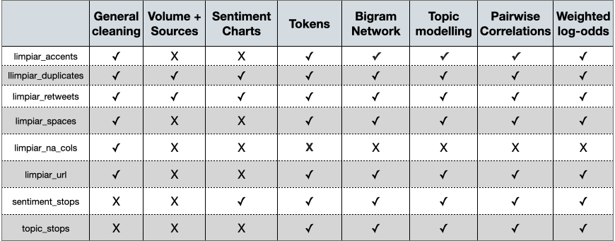

```{r, include = FALSE}
knitr::opts_chunk$set(
  collapse = TRUE,
  comment = "#>"
)
```

First we will load LimpiaR (you will usually want to load tidyverse too, but we do not do so in this Rmarkdown due to package-building complexities)"
```{r}
library(LimpiaR)
library(tidyverse)
```


For later reference, we've added a table to guide you on which LimpiaR function you will need for our most common outputs/analyses:

```{r, echo = FALSE}


```


LimpiaR is a small package built to speed up the data pre-processing and cleaning workflow. Let's create a very basic example data set to demonstrate a workflow with a mixture of LimpiaR functions and commonly-used text mining packages.

```{r}

df <- data.frame(`Mention Content` = cbind(c("Hello, what's your name?",
                                           "RT LINK BIO BUY NOW",
                                           "a mi no me gustaría",
                                           "a mi no me gustaría",
                                           "a mi no  mé   gustaría",
                                           "hello, what's your name?",
                                           "I can't believe this article to be honest https://guardian.com/spampost", "yo no sé que ha pasado, pero no me gusta por nada")),
                 `Mention Url` = cbind(c("www.twitter.com/user/post",
                                       "www.facebook.com/user/post",
                                       "www.youtube.com/user/post",
                                       "www.forocoches.com/forum",
                                       "www.bbc.news.co.uk",
                                       "www.google.co.uk/images/post_url",
                                       "www.guardian.com/spam_post",
                                       "www.twitter.es/spanish_user")),
                 `Super Bad NA Column` = cbind(c(NA, NA, NA, NA, NA, 2, 1, NA)))


```

## Cleaning Data Frame Names

The first step is to clean up the column names, generally we want our columns to be all lowercase, with spaces marked by '_' (snake case) and no other punctuation. We can dip into the janitor package for a convenient and widely-used function to do this:

```{r}
df <- df %>% 
  janitor::clean_names()

original <- df #We'll copy our data frame for later use

names(df)
df
```

Cleaning the names like this every time you start a new project will save you a lot of time in the long run, as you won't get confused by capitals, and tab completion is much smoother when column names are in snake_case.

## Text Variable -> lower case

In the future you may want to perform some actions on the text variable before doing any pre-processing, but for now we are going to go ahead and put our text variable to lowercase, which is something we want to do for virtually every data set that we analyse. We do this so that strings like "HelLo" aren't seen as different to "hello" or "HELLO", which helps us when counting words and bigrams, or modelling topics!

```{r, echo = FALSE}
#We use the base R function tolower() on our text variable
df <- df %>%
  mutate(mention_content = tolower(mention_content))

```

Let's take a look at the first LimpiaR function. This function will replace accented characters with non-accented, e.g. é becomes e and ñ becomes n. Converting ñ to n has some slightly unwanted effects in that words like año(s) become ano(s). Later on this may become an issue, but for now the trade off is ok. We call limpiar_accents() on the text variable with the help of mutate() and use '<-' to keep the changges. 

```{r}
df <- df %>% 
  mutate(mention_content = limpiar_accents(mention_content))

#alternate syntax:
# df <- limpiar_accents(df, mention_content)
df


```

## Removing Duplicates

Next, we'll remove duplicates and "Deleted or protected mentions" from the text variable. The main reason we remove duplicates is to eradicate spam.

```{r}
df <- df %>%
  limpiar_duplicates(mention_content)
df

```
At first glance, it looks like our function may not be working properly, as two seemingly-identical strings remain. However, the tibble output is masking some spaces in one of our 'a mi no me gustaria' strings. How could we see that?

```{r}
df %>%
  pull(mention_content)
```

So, we could use another LimpiaR function to remove the excess whitespaces and try again:

```{r}
df <- df %>%
  limpiar_spaces(mention_content)%>%
  limpiar_duplicates(mention_content)

df
```


## Removing Retweets

Now our function seems to be working as expected. We can see that one of the posts begins with 'rt' which indicates that it is a retweet, often we will want to remove all retweets, so let's call another LimpiaR function: limpiar_retweets, on our data frame.

```{r}
df <- df %>%
  limpiar_retweets(mention_content)
df
```

The decision to remove retweets or not should be made on a case-by-case basis. If you leave retweets in, they will dominate topic models & bigram networks. However, they are an indicator of viral events, which may be important for some analyses. 

*If you decide to remove retweets, you can use the original data frame to analyse them*


## Removing URLs
 
Our data frame is getting pretty small, but in our larger data frames we often see the same URLs posted by many accounts or bots. We don't want our bigram networks, token charts or topic models to be filled with URLs. We will use another function: limpiar_url to remove URLs from our text variable:

```{r}
df <- df %>%
  limpiar_url(mention_content)
df
```

## Inspecting/Investigating a Specific Pattern

When working with larger data sets, we might want to inspect all of the posts which feature a certain pattern, to then copy the URL and take a screenshot, or examine for traces of spam. The limpiar_inspect function ouputs an inspectable data frame with just the text variable and the URL column for ease of inspection:

```{r}
limpiar_inspect(df, "article", mention_content, mention_url)
```

Personally I use limpiar_inspect heavily when I need to check the output of a bigram network.

## Removing NA-heavy Columns

You may have noticed that our data frame has a column which is filled with NA values, when dealing with small data sets, this is no issue. However, in large data sets (particularly when using RStudio) conserving memory is helpful. Reducing the dimensions of the data frame can also help us to put less strain on our working memories - as we can see more of the columns at once (underrated efficiency gain!).

The next LimpiaR function allows you to reduce the columns of your data frame, by selecting a threshold of non-NA values a column must surpass to be retained. If the threshold is 0.1, a column must have 10% or more values which are not NA, which is another way of saying it must have fewer than 90% NA values. If we set the threshold to 0.4, we would be asking R to retain the columns with 40% or more non-NA values, so fewer than 60% NA values.

```{r}

df <- limpiar_na_cols(df, 0.4)
df
```

We see that the NA-heavy column is deleted. What happens if we change the threshold to 0.2? Asking R to get rid of all columns that have 80% or more  Would we expect to have 3 columns or 2?

```{r}
limpiar_na_cols(original, 0.2)
```

## Combining Functions

We've now seen the majority of the first-release LimpiaR functions. Often they will need to be used separately , but sometimes we will want to use a few of them together in one big function call. The final function we will look at, limpiar_df, effectively does this, as well as allowing for the removal of punctuation. However, removing punctuation is not a given and should be removed only if there is a valid reason for doing so.

limpiar_df can:
remove empty rows
transform the text variable to lower case
replace accented characters with non-accented equivalents
remove URLs
remove retweets
remove punctuation
clean excess whitespace
remove duplicates (after all of the preceding elements have been carried out)

```{r, eval=FALSE}
limpiar_df(original, mention_content, remove_retweets = FALSE, remove_punctuation = FALSE)
```

We could also decide to remove retweets and punctuation:

```{r, eval= FALSE}
limpiar_df(original, mention_content, remove_retweets = TRUE, remove_punctuation = TRUE)
```

Using limpiar_df won't always be the correct answer, but once you understand what each function in LimpiaR does, you will be able to make an educated guess and use limpiar_df to drastically speed up your analyses.

Next time we will be looking at LimpiaR's stop words dictionary, creating your own stop words lists and how to remove them from the text, a vital step in most text mining projects.


