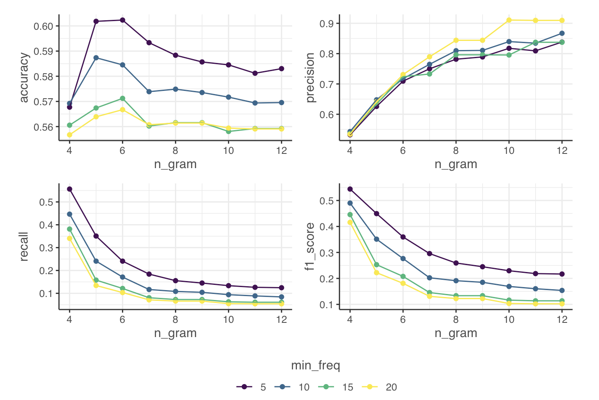

```{r, include = FALSE}
knitr::opts_chunk$set(
  collapse = TRUE,
  comment = "#>",
  message = FALSE,
  warning =  FALSE
)
```

```{r setup, message=FALSE, warning=FALSE}
library(LimpiaR)
```

# The Problem

Extracting useful information from large, unstructured internet datasets is a difficult task even when the datasets are clean. It is an *impossible* task with datasets riddled by bot network content, spammers, duplicates, and near-duplicates. 

Sadly our datasets do not come ready-cleaned, and we often have to remove hundreds and thousands of almost identical documents. Without automated, or semi-automated, assistance, this process is extremely time consuming and quickly becomes intractable as the size of our dataset grows.

To make a bad situation worse, there is no one-size fits all definition of 'near duplicate'. Let's look at two pairs of documents:

**Pair 1**
  
  >i. Arsenal are my favourite team
  ii. Liverpool are my favourite team

**Pair 2**

> i. @jiryan_2 wants to make you rich! Click here for amazing crypto opportunity www.definitelynotascam.com/get_rich_quick
ii. @jiryan_2 wants to make you wealthy! Click here for amazing crypto opportunity www.definitelynotascam.com/get_rich_quick

It should be quite clear that one of these pairs of documents is more problematic than the other, and yet both documents only differ by a single world. So even in principle, we wouldn't want to write some code to 'check if there is another document which only differs by one word, and remove both documents if there is' - we need something a bit more nuanced. 

# A Solution - `limpiar_spam_grams()`

We developed an in-house solution which looks at recurrent n-grams ^[elsewhere called shingles] within a dataset, where grams are words - n = 1, bigrams are n = 2, trigrams are n = 3 and so on. The algorithm is not language specific, so it can be applied across any language which has clear delimiters between words.

The algorithm works as follows:

1. We count the occurrence of every n-gram across all documents in our dataset. Where the value of n is set by the user in the `n_gram` parameter.
2. We filter the n-grams for those that occur above a `min_freq`.
3. We filter our documents that have any n-gram from this list, we retain documents that do not have any n-gram.
4. We return a list of: the 'spam_grams' - the n-grams which occur above the `min_freq`, the remaining data, and the deleted data, for the user to inspect.

## Example code

We should save the output of `limpiar_spam_grams()` to a variable, as this variable will contain our list of \$spam_grams, \$data, \$deleted. We'll use the `limpiar_examples` dataset, which is a small, toy dataset of only 10 rows. We can read every document in this dataset, and quickly verify the outputs; so it is handy for learning, but in reality we will be working with much larger datasets so verification will take up more of our time.

We run the code with low values for `n_gram` and `min_freq` because our dataset is small, and it does not contain many near duplicates. We ask the function to find any substring within a document of 3 words that is seen in the entire dataset that is seen in at least 2 documents.

```{r}
spam_grams_output <- limpiar_examples %>%
  limpiar_spam_grams(mention_content, n_gram = 3, min_freq = 2)
```

We can check what's in the list simply with `names()`.
```{r}
names(spam_grams_output)
```

We confirm that we have the three elements of the list that we expect. Now we can take a look at `spam_grams` to see what strings the function is suggesting we delete:
```{r}
spam_grams_output$spam_grams
```

Upon visual inspection, we see that the strings are coming from two pairs of documents - one is a tweet + a retweet - by authors Don Quijote & Sancho Panza. The way retweets are formulated, it makes sense for them to be treated as near duplicates. We also have a pair of exact duplicates by EL Sordo and Commander Miranda - we would expect duplicates to be flagged as near duplicates. So in this case the function is working. 

However, if we look at the `ngrams` that have been picked out to do the filtering, it's clear that they ar e not the most robust. We could imagine many documents that we do not in fact want to remove from a datset, containing at least one of these ngrams. It's vital that the user inspects these ngrams and considers whether documents containing them are likely to be spam-like.


## Working with the output

When we run the code and save it to a variable, we see that we have a list of 3 data frames (or tibbles).


`limpiar_spam_grams()` is an heuristic approach to cleaning, it is simple but effective. To mitigate risks, it's *very important* to check the outputs of both \$spam_grams and \$deleted. For large datasets this can be time consuming, but it is bad practice to remove large swathes of a dataset without having a clear idea of what you are removing.

We recommend the following strategy:

1. 

`limpiar_spam_grams()`

## Parameter Settings

Useful defaults based on our early research
Data-driven exploration

## Trade-off

{width=800 height=400}

## Limitations

# Another Solution
Locality Sensitive Hashing
