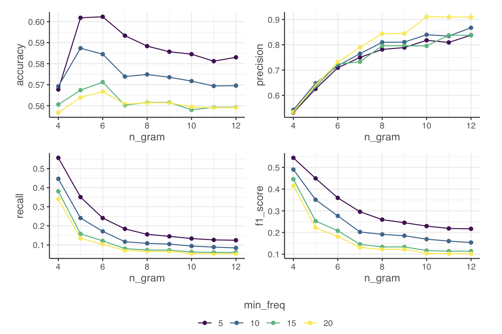

```{r, include = FALSE}
knitr::opts_chunk$set(
  collapse = TRUE,
  comment = "#>",
  message = FALSE,
  warning =  FALSE
)
```

```{r setup, message=FALSE, warning=FALSE}
library(LimpiaR)
```

#  Quick Start - Code

Quick example of how to run the code for the functions - get a dataset with a text variable and:
```{r}
limpiar_examples |>
  limpiar_spam_grams(mention_content, n_gram = 3, min_freq = 2)
```

```{r}
limpiar_examples |>
  limpiar_near_duplicates(mention_content, similarity = 0.5)
```

Now read the docs!

# The Problem

Extracting useful information from large, unstructured internet datasets is a difficult task even when the datasets are clean. It is an *impossible* task with datasets riddled by bot network content, spammers, duplicates, and near-duplicates. 

Sadly our datasets do not come ready-cleaned, and we often have to remove hundreds and thousands of almost identical documents. Without automated, or semi-automated, assistance, this process is extremely time consuming and quickly becomes intractable as the size of our dataset grows.

To make a bad situation worse, there is no one-size fits all definition of 'near duplicate'. Let's look at two pairs of documents:

**Pair 1**
  
  >i. Arsenal are my favourite team
  ii. Liverpool are my favourite team

**Pair 2**

> i. @jiryan_2 wants to make you rich! Click here for amazing crypto opportunity www.definitelynotascam.com/get_rich_quick
ii. @jiryan_2 wants to make you wealthy! Click here for amazing crypto opportunity www.definitelynotascam.com/get_rich_quick

It should be quite clear that one of these pairs of documents is more problematic than the other, and yet both documents only differ by a single world. So even in principle, we wouldn't want to write some code to 'check if there is another document which only differs by one word, and remove both documents if there is' - we need something a bit more nuanced. 

# A Solution - `limpiar_spam_grams()`

We developed an in-house solution which looks at recurrent n-grams ^[elsewhere called shingles] within a dataset, where grams are words - n = 1, bigrams are n = 2, trigrams are n = 3 and so on. The algorithm is not language specific, so it can be applied across any language which has clear delimiters between words.

The algorithm works as follows:

1. We count the occurrence of every n-gram across all documents in our dataset. Where the value of n is set by the user in the `n_gram` parameter.
2. We filter the n-grams for those that occur above a `min_freq`.
3. We filter our documents that have any n-gram from this list, we retain documents that do not have any n-gram.
4. We return a list of: the 'spam_grams' - the n-grams which occur above the `min_freq`, the remaining data, and the deleted data, for the user to inspect.

## Why does it work?

`limpiar_spam_grams()` is an heuristic approach to cleaning, it is simple but effective. The key insight for understanding why it works is to think about [perplexity](https://en.wikipedia.org/wiki/Perplexity){target="_blank"} in the Information Theory/language modelling sense. Sequences of natural language are high in perplexity - for most ideas that we want to communicate, there are many words we could choose from to communicate the idea. This means that two people describing the same idea are unlikely to use the same words. So when ideas are communicated with the exact same words, it is likely that they have come from the same source, i.e. the process that generated them was not independent. This is how we can recognise unsophisticated spammers and bot networks.

**Sentence 1:** The unexpected shower forced all the beachgoers to quickly gather their belongings and seek shelter in nearby buildings.

**Sentence 2:** The sudden downpour prompted the seaside visitors to hastily collect their items and dash into adjacent structures.

The idea communicated is the same, but the words are different. 

## Example code

Let's run through some code to see how the function is applied. We'll save the output of `limpiar_spam_grams()` to a variable - this variable will contain our list of \$spam_grams, \$data, \$deleted. We'll use the `limpiar_examples` dataset, which is a small, toy dataset of only 10 rows (documents). We can read every document in this dataset, and quickly verify the outputs; so it is handy for learning, but in reality we will be working with much larger datasets so verification will take up more of our time.

We run the code with low values for `n_gram` and `min_freq` because our dataset is small, and it does not contain many near duplicates. We ask the function to find any substring within a document of 3 words that is seen in the entire dataset that is seen in at least 2 documents.

```{r}
spam_grams_output <- limpiar_examples |>
  limpiar_spam_grams(mention_content, n_gram = 3, min_freq = 2)
```

We can check what's in the list simply with `names()`.
```{r}
names(spam_grams_output)
```

We confirm that we have the three elements of the list that we expect. Now we can take a look at `spam_grams` to see what ngrams the function is suggesting we delete:
```{r}
spam_grams_output$spam_grams
```

If we look at the `ngrams` that have been picked out to do the filtering, it's clear that they ar e not the most robust. We could imagine many documents that we do not in fact want to remove from a datset, containing at least one of these ngrams. It's vital that the user inspects these ngrams and considers 
whether documents containing them are likely to be spam-like.

If we move to inspecting the actual documents that were deleted, we see that the ngrams in \$spam_grams were coming from two pairs of documents - one is a tweet + a retweet - by authors Don Quijote & Sancho Panza. The way retweets are formulated, it makes sense for them to be treated as near duplicates. We also have a pair of exact duplicates by EL Sordo and Commander Miranda - we would expect duplicates to be flagged as near duplicates. So **in this case** the function is working as intended.
```{r}
spam_grams_output$deleted
```

However, given what we noticed in the \$spam_grams output, we would not want to use these exact parameters on a larger dataset, because we have too many ngrams which could be used in non-spam-like documents. 

This raises a question, what should we set as starting parameters for working with `limpiar_spam_grams()` on larger datasets?

## Parameter Settings

From experience and early research, we suggest setting `ngram = 7` as a starting point, and `min_freq` should be scaled with the number of documents in the dataset. Good starting points would be to take the log of the size of the dataset, or the square root.

Why the log or the square root?


Ultimately this decision is empirical - and you should be generating data as you use the function, i.e. if you set `min_freq = 10`, you'll need to grab the \$deleted data tibble from the function's output, and sample documents, counting and recording how many you think are truly spam-like and should be removed. Keep doing this until you find the parameter for which ~90% of documents are spam-like. Record the outputs of your experiments.

### Trade-off
Setting the parameters results in a trade-off between [precision & recall](https://jamiehshare.github.io/ds_share_handbook/model_evaluation.html#precision) - if you set `ngram = 1`, and `min_freq =1`, you will remove every single document in your dataset that has 1 word in it. This will result in 100% recall of spam documents - because you remove every document. However, precision would be low.
```{r}
limpiar_examples |>
  limpiar_spam_grams(mention_content, 1, 1)
```

We have some results from early research which shows this precision / recall trade-off
{width=800 height=400}

## Limitations

Sometimes long substrings do not in fact indicate documents that we should want to remove, for example, some long substrings will naturally occur in many documents - for example when researching web browsers "I set Chrome to my default browser" is an `ngram =7` which may occur many times without indicating spam-like documents.

Likewise with quotes, you have probably seen this quote before many times:

> 'Life is like riding a bicycle. To keep your balance, you must keep moving.' 

It's often used in blogs, articles, explainers etc. as a hook or as supporting evidence. It is much longer than we would usually set the value of our `ngram =` parameter, meaning if it is seen across our documents more than `min_freq` times, then all of those documents would be deleted. Although in this case it's actually quite unlikely to be a problem, the general principle is a limitation of the approach.

Another limitation is that the function scales somewhat poorly with the size of documents - if we have many long documents in a large corpus of text, we will need a lot of time and memory to use `limpiar_spam_grams` as it currently works. As we often need to iterate over the parameters, this can be a barrier to usage.

# Another Solution - `limpiar_near_duplicates()`

`limpiar_spam_grams()` removes documents that contain a suspicious n-gram. `limpiar_near_duplicates()` asks a different question. It compares whole documents, finds groups of documents that are nearly identical, keeps the first document of each group, and removes the rest. Use it when you want to keep one copy of each repeated message rather than remove every document that matches a pattern.

## How similarity is measured

The function cuts each document into shingles, which are runs of `shingle_size` consecutive words. Text is lowercased and punctuation is removed before shingling, but your original text is returned untouched. Two documents are then compared with the Jaccard similarity of their shingle sets, which is the number of shingles they share divided by the number of shingles they have between them. A pair of identical documents scores 1, and a pair with no shared shingles scores 0. Any pair that scores at or above the `similarity` threshold counts as a near-duplicate pair.

Checking every pair of documents directly would need $N(N-1)/2$ comparisons, which becomes impractical long before 100,000 documents. The function avoids this with minhash and locality sensitive hashing (LSH). Each document's shingle set is compressed into a short signature of `n_hashes` numbers, built so that, for any pair of documents, the probability that their signatures agree in any one position is proportionate to their Jaccard similarity (which is unknown at runtime, and what we're trying to estimate). The signatures are then split into bands, and only documents that agree on every position within some band are compared properly. Similar documents agree on a band with high probability, and dissimilar documents rarely do, so the function only compares pairs that are likely to be near duplicates.

Every candidate pair is then checked with an exact Jaccard calculation before anything is removed. A document is only ever deleted because its true similarity to a kept document reached your threshold, never because of a hash collision.

The number of bands is chosen automatically (derivation below in appendix) from `similarity` and `n_hashes`. The signature is split into bands of equal width, and each candidate width implies a similarity level at which pairs start to reliably share a band. The function picks the widest band whose implied level does not exceed your threshold. Erring on the low side means some extra candidate pairs are checked, but the exact verification step removes those, whereas a pair that never shares a band is never recovered. Lowering `similarity` therefore forces narrower bands and more candidate pairs, which is why very low thresholds slow the function down. A larger `n_hashes` offers more widths to choose from, which is why it makes the band check sharper. The exact numbers are in the appendix at the end of this vignette.

## Example code

As with `limpiar_spam_grams()`, the output is a list. `$duplicates` summarises each group of near duplicates, `$data` holds the remaining documents, and `$deleted` holds the removed documents so you can inspect them.

```{r}
near_dupes <- limpiar_examples |>
  limpiar_near_duplicates(mention_content, similarity = 0.5)

names(near_dupes)
```

`$duplicates` has one row per group. `group` is the row number of the document that was kept, `n_duplicates` counts the documents removed from that group, and the similarity columns describe how close the removed documents were to the kept one.

```{r}
near_dupes$duplicates
```

`$deleted` shows every removed document with its `group` and its `similarity` to the kept document. Here the function found the tweet and retweet pair, and the pair of exact duplicates, which matches what `limpiar_spam_grams()` found on this dataset.

```{r}
near_dupes$deleted
```

When you are happy with what was removed, re-assign your data frame from the list:

```{r}
clean_df <- near_dupes$data
```

## Inspecting a group

Every `group` value is a document ID: the original row number of the document that was kept. The function adds this row number to the data as a `document` column, and `$data` keeps that column, so you can look up any group's kept document directly.

On a large dataset, start with `$duplicates`. It is already sorted so the groups that caused the most removals come first, and it carries the kept document's text, so it answers "which documents are the primary offenders?" without any extra counting:

```{r}
near_dupes$duplicates
```

To see one group in full, filter both sides by its ID. The kept document lives in `$data`, and everything removed for it lives in `$deleted`:

```{r}
group_id <- near_dupes$duplicates$group[[1]]

# the document that was kept
near_dupes$data |>
  dplyr::filter(document == group_id)

# the documents removed because they were near it
near_dupes$deleted |>
  dplyr::filter(group == group_id)
```

Because `document` records the row number from the *input* data, these lookups stay correct after rows have been removed - filter on `document`, not on the current row position.

The minhash signatures are built from randomly drawn hash functions, so the method is probabilistic. It is worth being clear about what is and is not left to chance:

- Precision is not left to chance. Every removal is confirmed with an exact similarity calculation, so a removed document really was at or above your threshold.
- Recall is left to chance. A small share of true near-duplicate pairs, mostly those close to the threshold, can fail to land in a shared band and go unnoticed.
- Results are reproducible. The hash functions are drawn from the `seed` argument, so the same data, parameters, and seed always return the same output. Changing the seed can change which borderline pairs are found.

You control the recall trade-off with `n_hashes`. More hash functions make the band check sharper, so fewer true pairs are missed, and the cost in run time grows linearly. The default of 100 recovered over 99% of true pairs in our testing against an exhaustive pairwise comparison. If a small number of missed borderline pairs would be a problem for your analysis, raise `n_hashes` to 200 and accept the longer run time.

## Parameter settings

`similarity`, or the share of shingles two documents have in common, is the most important tuneable parameter - this has the most pronounced effect on how strict or lenient the near-duplicate removal will be. In theory, a value of 1 would tend only to remove exact duplicates, a value of 0 would tend to removal all documents longer than the minimum shingle size. A good starting point is 0.7. Raise it towards 0.9 if you only want to catch copies with light edits, and lower it towards 0.5 if you also want to catch heavier rewrites. As with `limpiar_spam_grams()`, you should sample `$deleted`, judge how many removals you agree with, and adjust.

`shingle_size` defaults to 3 words. Larger shingles make the comparison stricter, because a single changed word breaks more shingles. Documents with fewer words than `shingle_size` produce no shingles and are always kept, which the Limitations section below shows in detail.

Very low `similarity` values make the banding step coarse, so the function checks many more candidate pairs and slows down. If you find yourself below 0.4, `limpiar_spam_grams()` is probably the better tool for what you are trying to do.

## Limitations

### Containment is not similarity

Jaccard similarity compares whole documents, so a short document copied inside a much longer one scores roughly the ratio of their lengths. Let's make this concrete with four documents. The bicycle quote from earlier appears word for word inside a longer article, a second copy of the quote has two words added, and a fourth document is unrelated.

```{r}
quote <- "Life is like riding a bicycle. To keep your balance, you must keep moving."

article <- paste(
  "Einstein wrote to his son Eduard in 1930 with a piece of advice that has",
  "been shared millions of times since.",
  quote,
  "The letter was sold at auction decades later, and the phrase now appears",
  "on posters, mugs, and motivational accounts across every social network."
)

quote_edited <- paste(quote, "So true!")

unrelated <- "The unexpected shower forced all the beachgoers to seek shelter in nearby buildings."

containment_df <- dplyr::tibble(
  doc = c("quote", "article", "quote_edited", "unrelated"),
  mention_content = c(quote, article, quote_edited, unrelated)
)

(
containment_out <- containment_df |>
  limpiar_near_duplicates(mention_content, similarity = 0.7)
)
```

Only `quote_edited` is removed. Against the original quote it scores 0.86, because almost all of its shingles are shared.

```{r}
containment_out$deleted |> dplyr::select(doc, group, similarity)
```

The article survives, even though it contains the quote word for word. It scores about 0.21 against the quote, because the article's own shingles outnumber the shared ones, and no realistic `similarity` setting would remove it. The unrelated document shares no shingles with any other document and scores 0.

```{r}
containment_out$data$doc
```

Whether the surviving article is a problem depends on your task. For social listening it is often what you want, because an article that quotes a viral post is a genuine document and should survive deduplication. If you do want to remove contained copies, no `similarity` setting will get you there, and you need a containment measure instead.

### Word order barely matters

Documents are compared as sets of shingles, so order is only preserved within each shingle's window of `shingle_size` words. A document with its paragraphs shuffled scores close to 1 against the original. For deduplication this is usually fine, because reordered boilerplate is still boilerplate, but the function cannot distinguish rearrangement from repetition.

### Very short documents are never removed

Documents with fewer words than `shingle_size` produce no shingles, so they are always kept, even when they are exact duplicates of each other. With the default `shingle_size = 3`, the two-word documents below never produce a shingle, so the function removes nothing.

```{r}
short_df <- dplyr::tibble(
  doc = 1:4,
  mention_content = c("Great product!", "Great product!", "Buy now", "Buy now")
)

short_out <- short_df |>
  limpiar_near_duplicates(mention_content, similarity = 0.7)

nrow(short_out$deleted)
short_out$data
```

All four documents are kept, including both exact duplicate pairs. If very short documents matter to your analysis, handle them separately, for example with `limpiar_duplicates()` for exact copies.

## Which function should I use?

Use `limpiar_spam_grams()` when a recurring phrase is the problem, for example a spam template where every message shares one sentence but the rest of the text varies. Near-duplicate detection can miss these, because the documents as a whole may not be similar enough.

Use `limpiar_near_duplicates()` when repeated documents are the problem, for example retweets, reposted copypasta, or syndicated articles. It judges whole documents, so a common but harmless phrase cannot cause a removal on its own, which is the main failure mode of `limpiar_spam_grams()`.

The two functions compose well. A reasonable pipeline removes exact duplicates with `limpiar_duplicates()`, then near duplicates with `limpiar_near_duplicates()`, then inspects what remains with `limpiar_spam_grams()`.

## Performance

The function is designed to run on an ordinary laptop. On a corpus of 100,000 social-media-length documents it runs in about 10 seconds, and in our benchmarks it was faster than the equivalent pipeline in Python's `datasketch` library. Run time grows close to linearly with the number of documents, because the banding step avoids the quadratic pairwise comparison.

Memory is not a barrier on smaller machines. At 100,000 documents the algorithm needs about 1GB of working memory, and it completed at full speed in our tests even when R was capped at that amount, so an 8GB laptop is enough. Memory scales with the total number of words rather than the number of documents, so a corpus of very long documents costs more than the same number of short posts. The full benchmark protocol and results live in `dev_docs/` in the package repository.

# Appendix: how the banding threshold is derived

The main text says that the number of bands is chosen automatically from `similarity` and `n_hashes`. The derivation takes three steps.^[The analysis treats signature positions as independent. The linear hash functions the implementation uses are only pairwise independent, and the standard treatment makes the same simplification, which is why we say the analysis "follows" the standard one rather than "proves" the result.] First, for a pair of documents with Jaccard similarity $s$, their signatures agree in any one position with probability $s$. Second, if the signature is split into $b$ bands of $r$ rows each, the pair agrees on all $r$ rows of one band with probability $s^r$, so a single band fails to match with probability $1 - s^r$. Third, across all $b$ bands, the pair shares at least one band, and so becomes a candidate pair, with probability

$$P(\text{candidate}) = 1 - (1 - s^r)^b$$

Plotted against $s$, the probability forms an S-shaped curve, and the curve rises steepest at approximately

$$t \approx \left(\frac{1}{b}\right)^{1/r}$$

which acts as the effective threshold of the band layout. Since $b = n_\text{hashes} / r$, the function computes it as $(r / n_\text{hashes})^{1/r}$. Given your `similarity` and `n_hashes`, it considers every divisor $r$ of `n_hashes` and picks the largest $r$ whose effective threshold does not exceed your `similarity`.

The table below evaluates the formula for every band layout available at the default `n_hashes = 100`. Each row shows a layout's effective threshold, and the probability that a pair at similarity 0.3, 0.5, 0.7, or 0.9 becomes a candidate pair. The table is computed directly from the formula, so it is reproducible arithmetic rather than an empirical benchmark.

```{r}
n_hashes <- 100
r <- which(n_hashes %% seq_len(n_hashes) == 0)
b <- n_hashes / r

p_candidate <- function(s) round(1 - (1 - s^r)^b, 3)

dplyr::tibble(
  bands = b,
  rows = r,
  threshold = round((r / n_hashes)^(1 / r), 2),
  s_0.3 = p_candidate(0.3),
  s_0.5 = p_candidate(0.5),
  s_0.7 = p_candidate(0.7),
  s_0.9 = p_candidate(0.9)
)
```

Reading the table explains both claims from the main text. A low `similarity` threshold forces a layout with few rows per band, and those layouts flag a large share of dissimilar pairs as candidates, all of which must be checked exactly, which is why low thresholds slow the function down. A larger `n_hashes` has more divisors, so the available effective thresholds are spaced more closely, and the function can pick a layout that sits nearer to your requested `similarity`, which is why more hash functions make the band check sharper.

The banding analysis follows Leskovec, Rajaraman and Ullman, *Mining of Massive Datasets*, 3rd edition, chapter 3, which is free to read at [mmds.org](http://www.mmds.org); the table evaluates $1 - (1 - s^r)^b$ for the divisors of `n_hashes = 100`. The minhash technique, and the containment measure mentioned in the Limitations section, come from Broder (1997), "On the resemblance and containment of documents".
